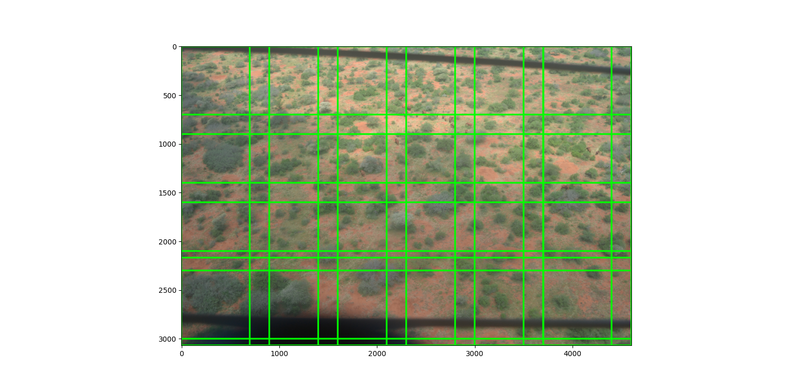

## Improving the precision and accuracy of animal population estimates with aerial image object detection

Aerial images with 4305 bounding boxes on zebra, giraffe, and elephants

Eikelboom JA, Wind J, van de Ven E, Kenana LM, Schroder B, de Knegt HJ, van Langevelde F, Prins HH. Improving the precision and accuracy of animal population estimates with aerial image object detection. Methods in Ecology and Evolution. 2019 Nov;10(11):1875-87.

**The dataset is available at** [https://data.4tu.nl/articles/dataset/Improving_the_precision_and_accuracy_of_animal_population_estimates_with_aerial_image_object_detection/12713903/1](https://data.4tu.nl/articles/dataset/Improving_the_precision_and_accuracy_of_animal_population_estimates_with_aerial_image_object_detection/12713903/1)

## Reference

If you use this dataset, please cite the following paper:
https://doi.org/10.1111/2041-210X.13277

## Preprocessing
### Rotating images with wrong orientation
> [!CAUTION]
> The dataset contains some images that are wrongly rotated upside down (180 degrees) for an unknown reason. Rotate them back by 180 degrees to correct the orientation.

Firstly, run `rotate_wrong_oriented_img.py` to quickly rotate images are listed in `list of wrong oriented image.txt`
```
py .\rotate_wrong_oriented_img.py
```
### Generate new annotations_train.csv
> [!CAUTION]
> The author provided a `annotations_trains.csv` file which contains the labels of tiles (image after cutting). We'll have to make a different `annotations_train.csv` to use for later

Run `generate_annotation_train.py`:
```
py .\generate_annotation_train.py
```
### Convert CSV annotations to YOLOv8 format

The annotations of the dataset are in RetinaNet CSV format:
- `annotation_images.csv` is the raw annotations file.
- `annotation_test.csv, annotation_train.csv, annotation_train.csv` are the annotations that were used for testing, training, and validation respectively.

**To convert them to YOLOv8 format, run the `convertformat.py` script.**
The script will create a new folder `labels` inside each `train`, `test`, and `val` folder and save the annotations in YOLOv8 format
```
# run the script with both train, test, and validation annotations in 1 command
py .\convertformat.py annotations_test.csv annotations_train.csv annotations_val.csv

# default class names are Zebra, Giraffe, and Elephant or specify the class names by a list
py .\convertformat.py annotations_test.csv annotations_train.csv annotations_val.csv Zebra,Giraffe,Elephant

# or run the script separately for each annotation file
py .\convertformat.py annotations_test.csv
py .\convertformat.py annotations_train.csv
py .\convertformat.py annotations_val.csv
```
After this step the dataset structure should be like this:
```
data
├───test         (112 images + 1 subfolder)
│   └───labels   (112 files .txt)
├───train        (393 images + 1 subfolder)
│   └───labels   (393 files .txt)
└───val          (56 images + 1 subfolder)
    └───labels   (56 files .txt
```
### Setup YOLOv8 dataset structure:
Run `setup_yolo_dataset_structure.py` to move images into `images` subfolder inside each `train`, `val`, and `test` set. 
```
py .\setup_yolo_dataset_structure.py
```
After this step the dataset structure should look like this:
```
data
├───test
│   ├───images (112 images)
│   └───labels (112 files .txt)
├───train
│   ├───images (393 images)
│   └───labels (393 files .txt)
└───val 
    ├───images (56 images)
    └───labels (56 files .txt)
```
### Image tiling
Run `cut_tiles.py` to start image tiling:
```
# Run with default arguments
py .\cut_tiles.py train test val

# Run with custom arguments
py .\cut_tiles.py train test val --tile_width 900 --tile_height 900 --tile_overlap 200 --truncated_percent 0.3 
```
**Args**:
- `folder_path`(str, multiple args): path to the folders containing two subfolder `images` and `labels` (train, test, val)
- `--tile_witdh` (default: 900): width of the tile (by pixel)
- `--tile_height` (default: 900): height of the tile (by pixel)
- `--tile_overlap` (defauit: 200): Overlap between tiles (by pixel)
- `--truncated_percent` (default: 0.1): if the percentage of bounding boxes inside tile is below this threshold, it will be ignore
- `--overwriteFiles` (default: True): overwrite existing files
- 
**Explain**:
  
Below is the expression used to calculate the number of tiles along a dimension of image (either width or height). The first part calculates the minium number of tiles with no overlap that can occupy all the image along one dimension (width or height). The second part calculates the number of tiles needed to fill in the space left behind when the $`\alpha`$ tiles overlap each other 
```math
 n_{tiles} = \underbrace{\left \lceil \frac{\text{size}_{img}}{\text{size}_{tile}}\right \rceil}_{\alpha}
+ \left \lceil \frac{\text{size}_{img} - \left ( \alpha \cdot \text{size}_{tile} - \text{overlap} \cdot \left ( \alpha - 1 \right ) \right )}{\text{size}_{tile} - \text{overlap}}\right \rceil
```
For example, `train\DPP_00418` has size of $`4603 \times 3068`$, with the size of each tile is $`900 \times 900`$ and desired overlap is $`200`$. If $`overlap`$ is $0$, the width dimension ($4603px$) only need $`\alpha =  \left \lceil  \frac{4603}{900} \right \rceil = 6`$ tiles. But with $`\text{overlap}=200`$, $6$ tiles only occupy $`6 \cdot 900 - 200 \cdot 5 = 4400`$. The remaining width are $4603-4400=203$ and we divide this with $900-200=700$. Take result into ceiling function and add it to $`\alpha`$ and we got $7$ as the final number of tiles that can fit the width dimension. Doing the same for the height dimension we'll get $5$. In summary we'll get $35$ tiles for this images.
```
x_start = 0, y_start = 0, x_end = 900, y_end = 900
x_start = 0, y_start = 700, x_end = 900, y_end = 1600
x_start = 0, y_start = 1400, x_end = 900, y_end = 2300
x_start = 0, y_start = 2100, x_end = 900, y_end = 3000
x_start = 0, y_start = 2168, x_end = 900, y_end = 3068
x_start = 700, y_start = 0, x_end = 1600, y_end = 900
x_start = 700, y_start = 700, x_end = 1600, y_end = 1600
x_start = 700, y_start = 1400, x_end = 1600, y_end = 2300
x_start = 700, y_start = 2100, x_end = 1600, y_end = 3000
x_start = 700, y_start = 2168, x_end = 1600, y_end = 3068
x_start = 1400, y_start = 0, x_end = 2300, y_end = 900
x_start = 1400, y_start = 700, x_end = 2300, y_end = 1600
x_start = 1400, y_start = 1400, x_end = 2300, y_end = 2300
x_start = 1400, y_start = 2100, x_end = 2300, y_end = 3000
x_start = 1400, y_start = 2168, x_end = 2300, y_end = 3068
x_start = 2100, y_start = 0, x_end = 3000, y_end = 900
x_start = 2100, y_start = 700, x_end = 3000, y_end = 1600
x_start = 2100, y_start = 1400, x_end = 3000, y_end = 2300
x_start = 2100, y_start = 2100, x_end = 3000, y_end = 3000
x_start = 2100, y_start = 2168, x_end = 3000, y_end = 3068
x_start = 2800, y_start = 0, x_end = 3700, y_end = 900
x_start = 2800, y_start = 700, x_end = 3700, y_end = 1600
x_start = 2800, y_start = 1400, x_end = 3700, y_end = 2300
x_start = 2800, y_start = 2100, x_end = 3700, y_end = 3000
x_start = 2800, y_start = 2168, x_end = 3700, y_end = 3068
x_start = 3500, y_start = 0, x_end = 4400, y_end = 900
x_start = 3500, y_start = 700, x_end = 4400, y_end = 1600
x_start = 3500, y_start = 1400, x_end = 4400, y_end = 2300
x_start = 3500, y_start = 2100, x_end = 4400, y_end = 3000
x_start = 3500, y_start = 2168, x_end = 4400, y_end = 3068
x_start = 3703, y_start = 0, x_end = 4603, y_end = 900
x_start = 3703, y_start = 700, x_end = 4603, y_end = 1600
x_start = 3703, y_start = 1400, x_end = 4603, y_end = 2300
x_start = 3703, y_start = 2100, x_end = 4603, y_end = 3000
x_start = 3703, y_start = 2168, x_end = 4603, y_end = 3068
```
||
|:--:|
|*This figure depicts the tiles on the image. Start from left to right, top to bottom.* |

### Add YAML file
YOLOv8 requires a YAML file to train the model. The file should contain the following:
```
path: ../data
train: train/images
val: valid/images
test: test/images

nc: 3
names: 
  0: Zebra
  1: Giraffe
  2: Elephant
```
Save the file as `data.yaml` and place it in the `data` folder. 

Or you can run the `generate_yaml.py` script to generate the YAML file by specifying the number of classes and the class names:
```
# Default classes is already Zebra, Giraffe, and Elephant
py generate_yaml.py

# With classes
py generate_yaml.py Zebra,Giraffe,Elephant
```
## Augmentation
Coming soon
## Display images with bounding boxes 
Run the `display_bbox.py` (requires: `opencv`) with the following argument:
- `--data_path`: path to the data directory (which contains two subfolders: `images` and `labels`).
- `--yaml_path`: path to the YAML file.
- `--output_dir`(optional): path to the directory where the images will be saved.
- `--only_with_bbox`(optional, default: `True`): only choose images that have bounding boxes. Accept `'yes', 'true', 't', 'y', '1'` as `True` or `'no', 'false', 'f', 'n', '0'` as `False`. 
- `--num_samples`(optional, default: `1`): number of sample images to display.
- `--display` (optional, default: `False`): option to display the image with bounding boxes using opencv
Example usages:
```
py display_bbox.py --data_path data\train --yaml_path data\data.yaml --output_dir data\display_bbox --only_with_bbox 1 --num_samples 5 --display 0
```
## Training with YOLOv8
Training the model with YOLOv8 is straightforward.
1. Install Ultralytics via pip
```pip install ultralytics```
or clone the repository
```
git clone https://github.com/ultralytics/ultralytics
cd ultralytics
python setup.py install
```

2. Training:
Run `train.py` (it requires [wandb](https://wandb.ai/site) for logging)
#### Example usage:
```
cd path/to/datasets/
python train.py --model yolov8n.pt --logging True --data data.yaml --epochs 100 --batch 42 --imgsz 1088
--patience 30 --project detection --name exp --optimizer Adam --lr0 0.001
--momentum 0.9 --device 0,1,2 --plots True --save True
```
#### Args:
- `--model` (str, optional): path to model file, i.e. yolov8n.pt, yolov8n.yaml
- `--data` (str, optional): path to data file, i.e. coco128.yaml
> [!Note]
> Change the parameter `data` to absolute path of yaml file if the current working dir is not `data/`
> ```
> # if current dir is not `data/`
> py train.py --data path/absolute/to/yaml
> 
> # if current dir is data 'data/`
> py train.py --data data.yaml
> ```
- `--epochs` (int, optional): number of epochs to train for. Defaults to 100.
- `--patience` (int, optional): epochs to wait for no observable improvement for early stopping of training. Defaults to 50.
- `--batch` (int, optional): number of images per batch (-1 for AutoBatch). Defaults to 16.
- `--imgsz` (int, optional): size of input images as integer. Defaults to 640.
- `--save` (bool, optional): save train checkpoints and predict results. Defaults to False.
- `--save_period` (int, optional): Save checkpoint every x epochs (disabled if < 1). Defaults to -1.
- `--cache` (bool, optional): True/ram, disk or False. Use cache for data loading. Defaults to False.
- `--device` (int, list[int], optional): device to run on, i.e. cuda device=0 or device=0,1,2,3 or device=cpu. Defaults to None.
- `--workers` (int, optional): number of worker threads for data loading (per RANK if DDP). Defaults to 8.
- `--project` (str, optional): project name. Defaults to "runs".
- `--name` (str, optional): experiment name. Defaults to "exp".
- `--exist_ok` (bool, optional): whether to overwrite existing experiment. Defaults to False.
- `--pretrained` (bool, optional): (bool or str) whether to use a pretrained model (bool) or a model to load weights from (str). Defaults to True.
- `--optimizer` (str, optional): optimizer to use, choices=[SGD, Adam, Adamax, AdamW, NAdam, RAdam, RMSProp, auto]. Defaults to "auto".
- `--verbose` (bool, optional): whether to print verbose output. Defaults to False.
- `--seed` (int, optional): random seed for reproducibility. Defaults to 0.
- `--deterministic` (bool, optional): whether to enable deterministic mode. Defaults to True.
- `--single_cls` (bool, optional): train multi-class data as single-class. Defaults to True.
- `--rect` (bool, optional): rectangular training with each batch collated for minimum padding. Defaults to False.
- `--cos_lr` (bool, optional): use cosine learning rate scheduler. Defaults to False.
- `--close_mosaic` (int, optional): disable mosaic augmentation for final epochs (0 to disable). Defaults to 10.
- `--resume` (bool, optional): resume training from last checkpoint. Defaults to False.
- `--amp` (bool, optional): Automatic Mixed Precision (AMP) training, choices=[True, False]. Defaults to True.
- `--fraction` (float, optional): dataset fraction to train on (default is 1.0, all images in train set). Defaults to 1.0.
- `--profile` (bool, optional): profile ONNX and TensorRT speeds during training for loggers. Defaults to False.
- `--freeze` (Union[int, List, None], optional): (int or list, optional) freeze first n layers, or freeze list of layer indices during training. Defaults to None.
- `--lr0` (float, optional): initial learning rate (i.e. SGD=1E-2, Adam=1E-3). Defaults to 0.01.
- `--lrf` (float, optional): final learning rate (lr0 * lrf). Defaults to 0.01.
- `--momentum` (float, optional): SGD momentum/Adam beta1. Defaults to 0.937.
- `--weight_decay` (float, optional): optimizer weight decay 5e-4. Defaults to 0.0005.
- `--warmup_epochs` (float, optional): warmup epochs (fractions ok). Defaults to 3.
- `--warmup_momentum` (float, optional): warmup initial momentum. Defaults to 0.8.
- `--warmup_bias_lr` (float, optional): warmup initial bias lr. Defaults to 0.1.
- `--box` (float, optional): box loss gain. Defaults to 7.5.
- `--cls` (float, optional): cls loss gain (scale with pixels). Defaults to 0.5.
- `--dfl` (float, optional): dfl loss gain. Defaults to 1.5.
- `--label_smoothing` (float, optional): label smoothing (fraction). Defaults to 0.0.
- `--nbs` (int, optional): nominal batch size. Defaults to 64.
- `--val` (bool, optional): validate/test during training. Defaults to True.
- `--plots` (bool, optional): save plots and images during train/val. Defaults to True.
-  `--logging` (bool, optional): whether to log to wandb. Default to True.


